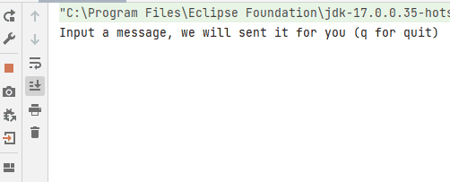

= Asynchronous communication
:hardbreaks-option:

ifdef::env-github[]
:tip-caption: :bulb:
:note-caption: :information_source:
endif::[]

Steps marked with ✔️ are verifications that all is working as expected and that you can keep running through the exercise.

The purpose of this exercise is to build a minimalist application (chat), using a message broker, RabbitMQ.

== Prerequisites

* Install Git (cf https://git-scm.com/book/en/v2/Getting-Started-Installing-Git)
* (On Windows, have a posix terminal, such as **Git Bash**)
* Configure Git with your name and email
** `git config --global user.name "John Doe"`
** `git config --global user.email johndoe@example.fr`
* If not existing, generate an SSH key and give the public part to GitHub (cf https://help.github.com/articles/connecting-to-github-with-ssh/)

* Install JDK 17 (cf https://adoptium.net/)
* ✔️ `javac -version` and `java -version` command should display the version **17**

* Install Maven (cf https://maven.apache.org/install.html)
* ✔️ `mvn -version` command should display version *3.8.6* or higher

* Install IntelliJ Community (cf https://www.jetbrains.com/fr-fr/idea/download)

* Install Docker and Docker Compose V2 (Docker Desktop for Windows and Mac)

== Part 0 - Repository creation using a template

* On the template page https://github.com/lernejo/maven_starter_template, click on "Use this template"
* Fill in the repository name: **amqp_training**
* Check the repository as **private**
* Create the repository by clicking on "*Create repository from template*"
* Invite the current teacher as a read-only member
* Do not forget to update badges (follow
  -> https://github.com/lernejo/exercises/blob/master/maven_fr/EXERCISE.adoc#partie-6---live-badges)
* Clone this new repository using the *SSH URL*
* The default branch is *main*, and the exercise will be graded on this branch

== Part 1 - BOM & Dependencies

[NOTE]
====
A BOM (**B**ill **O**f **M**aterials) is a list of libraries and frameworks for which versions are compatible.

As the Java ecosystem evolves fast, breaking changes (method or class removed, etc.) frequently happen.

That is why the biggest frameworks (such as Spring-Boot) publish BOM to ensure that all dependencies of a project work well with each other.
====

* In the *pom.xml* file, add Spring-Boot BOM in the `<dependencyManagement>` section

[source,xml]
----
<dependencyManagement>
    <dependencies>
        <dependency>
            <groupId>org.springframework.boot</groupId>
            <artifactId>spring-boot-dependencies</artifactId>
            <version>2.7.4</version>
            <scope>import</scope>
            <type>pom</type>
        </dependency>
    </dependencies>
</dependencyManagement>
----

* Add the interesting dependency in the `<dependencies>` section

[source,xml]
----
<dependencies>
    <dependency>
        <groupId>org.springframework.boot</groupId>
        <artifactId>spring-boot-starter-amqp</artifactId>
        <!-- <version>???</version> --> <!--1-->
    </dependency>
</dependencies>
----

<1> The version is not filled because it is handled by the BOM

== Part 2 - Dockerized RabbitMQ

Docker is a tool allowing to run containers based on images.

Images themselves are archives containing the required/wanted binaries (OS, tools, application, etc.).

Docker Compose is a container orchestrator, able to manage, consistently, from the same descriptor file, a set of containers.

We will use Docker Compose to start an instance of RabbitMQ without having to install it.

* Create a *docker-compose.yml* file at the root of the project with the following content:

[source,yml]
----
version: "3.9"
services:
    rabbitmq:
        # https://hub.docker.com/_/rabbitmq
        image: rabbitmq:3.9.7-management-alpine
        container_name: rabbitmq
        ports:
            - 5672:5672 # AMQP
            - 15672:15672 # HTTP (Management)
----

* Start the broker with `docker compose up -d`
* ✔️ Check that the service is available (http://localhost:15672 guest/guest)

== Part 3 - AMQP Listener

First off, we will now code a listener which displays the content of received messages in the console (`System.out.println`).

* In the `fr.lernejo.chat` package, create a class `ChatMessageListener`, annotated with `@Component`

[NOTE]
====
Annotations such as `@Controller`, `@Component`, `@Service`, etc. are marking annotations indicating to the framework the role of marked classes and that it must handle their lifecycle (construction, injection, notifications, destruction).
====

* In this class, create a public method `onMessage` which will take a `String` parameter, it is this method which must display the content of a message in the console
* Create a class `fr.lernejo.chat.ChatApp` annotated with `@SpringBootApplication`
* Add to it a `main` method with the following content: `SpringApplication.run(ChatApp.class, args);`
* Create a class `AmqpConfiguration` annotated with `@Configuration` with the following content:

[source,java]
----

private static final String queueName = "chat_messages";

@Bean
Queue queue() {
    return new Queue(queueName, true);
}

@Bean
MessageListenerAdapter listenerAdapter(ChatMessageListener chatMessageListener) {
    return new MessageListenerAdapter(chatMessageListener, "onMessage");
}

@Bean
SimpleMessageListenerContainer container(ConnectionFactory connectionFactory, MessageListenerAdapter listenerAdapter) {
    SimpleMessageListenerContainer container = new SimpleMessageListenerContainer();
    container.setConnectionFactory(connectionFactory);
    container.setQueueNames(queueName);
    container.setMessageListener(listenerAdapter);
    return container;
}
----

* Start the application
* Send a message on the queue created by the application during its startup, suing the RabbitMQ management web interface.
** When sending the message, do not forget to add a property called `content_type` with the value: `text/plain`
* ✔️ Check that the message is displayed in the console

== Part 4 - Read the last 10 messages

We are now storing the last 10 messages in the memory of our application, and make them available though an HTTP API.

* Add the following dependency:

[source,xml]
----
<dependencies>
    <dependency>
        <groupId>org.springframework.boot</groupId>
        <artifactId>spring-boot-starter-web</artifactId>
    </dependency>
</dependencies>
----

* Create a class `ChatMessageRepository` which will store the last 10 messages. Therefore, this class will have two methods:
** `void addChatMessage(String message)`
** `List<String> getLastTenMessages()`
* Inject an instance of this class in `ChatMessageListener` and add the storage of the message in the _repository_
* Create a class `ChatMessageController` annotated with `@RestController`
* Add to it a method annotated with `@GetMapping` which will return the list of the last 10 messages formatted in JSON when calling the URL http://localhost:8080/api/message
* ✔️ Check that the application works as expected by sending messages using the RabbitMQ management web interface

== Part 5 - Multi-module Maven project

In this part, we will transform our mono-module Maven project into a multi-module one.
The code written until then will be stored in the *server* module.

* Create a new module called *server* in the project
** Right-clic -> New -> Module -> Maven
* Move into it the code and the `<dependencies>` section of the root *pom.xml*
* Notice that a `<packaging>pom</packaging>` tag appeared in the root *pom.xml*, as well as a `<modules>` section
* ✔️ Launch a compilation of the project from teh root directory and check that it ends in success

== Part 6 - AMQP client

We will now code an AMQP client to be able to send messages from the terminal.

* Create a new module *client* (*[.underline]#next to#* the *server* one)
* In the *pom.xml* of this new module, add the dependency to the *starter-amqp* of *spring-boot*
* In the `fr.lernejo.chat` package, create a class `Launcher` annotated with `SpringBootApplication`
* Add to it a `main` method which should loop over the standard input et send the message at each carriage return hit by the user.

[NOTE]
====
To start a Spring context without loosing grip of the execution flow, we can use `AnnotationConfigApplicationContext` with configuration classes as parameter.
In our case, there is only one, the `Launcher` class.

To get an object which lifecycle is handled by this context, use the `getBean(Class<T>)` method.

An object that can simply send messages is supplied by *spring-rabbit*, its type is `RabbitTemplate`.

This object has a method `convertAndSend(String, String, Object)` which allows to send a message on a specific _exchange_ using a _routing-key_.

Exchanges and routing-keys are key concepts in RabbitMQ routing feature, however as we use only one queue, we will use the default _exchange_ which allows to send a message on the queue named like the _routing-key_.
====

== Part 7 - ✔️ Check the asynchronism of the communication

We now have two distinct applications communicating though a message broker.

These applications do not depend on the other to work properly (to the opposite of a synchronous communication, like HTTP).

Here is a valid scenario;

* Stop the server
* Start the client
* :love_letter: Send some messages
* Stop the client
* Start the server
** :mailbox: Messages are received then
* ✔️ Check the presence of the messages using the HTTP API
