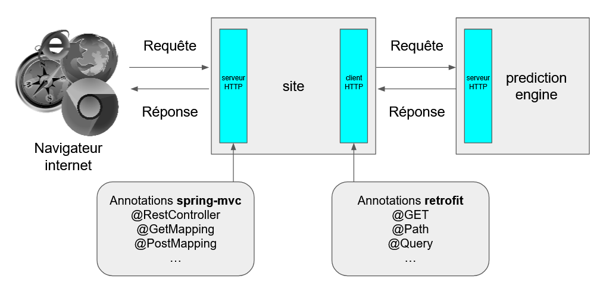

= API HTTP avec Spring : production et consommation
:hardbreaks-option:

Préfixé par &#x1F4D8;, des "checkpoints" pour vous aider à vérifier que vous avez tout bon.

Cet exercice a pour but de voir l’utilisation d’API HTTP JSON, en

* production : le code démarre un serveur HTTP qui répond à des requêtes spécifiques
* consommation : le code appelle un serveur HTTP distant

Nous allons utiliser :

* *Spring web-mvc* pour gérer l’exposition de l’API serveur
* *retrofit* comme client HTTP

Le thème de ce projet est de construire le site d’une agence de voyage qui proposera aux utilisateurs des destinations en fonction de la différence de température avec celle du pays de l’utilisateur.

== Architecture simplifiée

Une seconde application sera à développer dont le but sera de fournir la température moyenne actuelle d’un pays.

== Notation

La notation se découpera en plusieurs parties :

* Le projet compile
* Le projet démarre (la méthode `fr.lernejo.travel.Launcher#main` doit démarrer un serveur HTTP sur le port 8080)
* Les 2 APIs `POST /api/inscription` et `GET /api/travels` décrites ci-dessous sont
** Disponibles
** Conforment aux schémas donnés
** Cohérentes (un appel à `GET /api/travels` après le démarrage de l’application ne donne rien, car `POST /api/inscription` n’a pas été appelée avant)
** Fonctionnelles (un appel à `GET /api/travels` retourne les *destinations* possibles pour les personnes déjà inscrites)
* L’historique *GIT* lisible et propre
** Pas de message de commit sans _**intention**_
** Pas de commit successifs avec le même message
** (-0.5 point de pénalité par commit ne respectant pas ces règles)
** Voir cet article pour plus d’information https://chris.beams.io/posts/git-commit/
* Le **Style** doit permettre de lire le code facilement
** Les méthodes doivent faire moins de 15 lignes
** Les classes moins de 80 lignes (-1 point de pénalité pour les écarts)
** Pas de champs mutables (tous les champs doivent être marqués final)
** Pas de champ ou méthode statique (sauf pour la méthode `main`)
* L’intégration continue est fonctionnelle
* Les Badges de build et de couverture sont disponibles dans le fichier *README.md*
* La couverture du code est > *80%*

Un front-end basique (HTML, CSS, JS) vous est fourni.
Vous êtes libre de le modifier ou même de le remplacer par une technologie de votre choix (vue, preact, etc.).
La note ne tiendra pas compte de cette partie.

== Partie 0 - Création du dépôt via un template

* Sur la page du template https://github.com/lernejo/travel_agency_template, cliquer sur "Use this template"
* Renseigner comme nom de dépôt : *travel_agency*
* Marquer le futur dépôt comme *public*
* Créer le dépôt en cliquant sur "Create repository from template"

== Partie 1 - Adaptation de la CI

* Dans le fichier *README.md*, changer les URLs des badges (images [.underline]#*ET*# liens) afin que ceux-ci correspondent à votre dépôt
* Indexer et commiter ces changements

[NOTE]
====
Le code fourni dans le template est composé d’un projet Maven _multimodule_, dont les deux modules représentent les deux applications à développer (`site` et `prediction-engine`).

L’application `site` démarre un serveur HTTP qui écoute sur le port 8080, le port du serveur HTTP de la seconde application sera 7080.
====

== Partie 2 - Coder les APIs HTTP JSON

Pour faire fonctionner http://localhost:8080/[le frontend], construire deux APIs dans le module *site* :

* `POST /api/inscription` acceptant comme entrée (`body`) un document JSON valide selon ce schéma

[source,json]
----
{
    "$schema": "http://json-schema.org/schema#",
    "type": "object",
    "properties": {
        "userEmail": {
            "type": "string",
            "format": "email"
        },
        "userName": {
            "type": "string"
        },
        "userCountry": {
            "type": "string"
        },
        "weatherExpectation": {
            "type": "string",
            "enum": [
                "WARMER",
                "COLDER"
            ]
        },
        "minimumTemperatureDistance": {
          "type": "integer",
          "minimum": 0,
          "exclusiveMaximum": 40
        }
    },
    "required": [
        "userEmail",
        "userName",
        "userCountry",
        "weatherExpectation",
        "minimumTemperatureDistance"
    ]
}
----

Par exemple :

[source,json]
----
{
    "userEmail": "machin@truc.com",
    "userName": "machin",
    "userCountry": "France",
    "weatherExpectation": "WARMER",
    "minimumTemperatureDistance": 20
}
----

* `GET /api/travels?userName={userName}` retournant une liste des destinations potentielles, valide par rapport à ce schéma :

[source,json]
----
{
    "$schema": "http://json-schema.org/schema#",
    "type": "array",
    "items": {
        "type": "object",
        "properties": {
            "country": {
                "type": "string"
            },
            "temperature": {
                "type": "number"
            }
        },
        "required": [
            "country",
            "temperature"
        ]
    }
}
----

Par exemple :

[source,json]
----
[
    {
        "name": "Caribbean",
        "temperature": 32.4
    },
    {
        "name": "Australia",
        "temperature": 35.1
    }
]
----

Vous pouvez ici retourner des données fixes ou aléatoires, le comportement définitif basé sur l’application *prediction-engine* sera à réaliser par la suite.

* &#x1F4D8; le frontend fourni (http://localhost:8080) fonctionne avec les données simulées

== Partie 3 - L’API de prédiction

Le code qui charge les températures pour un certain nombre de pays est déjà existant dans le module *prediction-engine*.

* Coder l’API HTTP `GET /api/temperature?country={country}` retournant une liste des températures du pays sur les 2 derniers jours, valide par rapport à ce schéma :

[source,json]
----
{
    "$schema": "http://json-schema.org/schema#",
    "type": "object",
    "properties": {
        "country": {
            "type": "string"
        },
        "temperatures": {
            "type": "array",
            "minItems": 2,
            "maxItems": 2,
            "items": {
              "type": "object",
              "properties": {
                "date": {
                  "type": "string",
                  "format": "date"
                },
                "temperature": {
                  "type": "number"
                }
              },
              "required": [
                  "date",
                  "temperature"
              ]
            }
        }
    },
    "required": [
        "country",
        "temperatures"
    ]
}
----

Par exemple :

[source,json]
----
{
    "country": "France",
    "temperatures": [
        {
            "date": "2021-12-04",
            "temperature": 12
        },
        {
            "date": "2021-12-03",
            "temperature": 7
        }
    ]
}
----

Dans le cas où le pays n’est pas reconnu, l’API doit renvoyer le code HTTP 417.

== Partie 4 - Client HTTP

* Ajouter la dépendance **retrofit** au module *site* : `com.squareup.retrofit2:retrofit:2.9.0`
* Créer une nouvelle interface afin de requêter l’API du module *prediction-engine* en vous servant de la documentation officielle : https://square.github.io/retrofit/
* Ajouter ce client HTTP comme bean dans le contexte de Spring
* Pour cela ajouter une méthode comme celle-ci dans la classe `Launcher` (en considérant que votre interface s’appelle `PredictionEngineClient`)

[source,java]
----
@Bean
PredictionEngineClient predictionEngineClient() {
    Retrofit retrofit = new Retrofit.Builder()
        .baseUrl("http://localhost:7080/")
        .build();

    return retrofit.create(PredictionEngineClient.class);
}
----

* &#x1F4D8; l’application (`Launcher#main`) démarre sans erreur

== Partie 5 - emboiter les pièces du puzzle

La logique de notre application sera simple, à chaque requête d’un utilisateur, charger le fichier *countries.txt* présent à la racine du classpath et effectuer pour chaque pays une requête vers l’API du module *prediction-engine*.
Calculer la moyenne des températures remontées pour chaque pays et filtrer les afin de ne remonter à l’utilisateur que ceux qui satisfont à ses critères (`weatherExpectation` et `minimumTemperatureDistance`).

[NOTE]
====
Charger le contenu d’un fichier présent dans le _classpath_ peut se faire comme ceci :

[source,java]
----
InputStream inputStream = this.getClass().getClassLoader().getResourceAsStream("myfile.txt");
String content = new String(resource.readAllBytes(), StandardCharsets.UTF_8);
Stream<String> lines = content.lines();
----
====

* Dans le module *site*, créer une nouvelle classe annotée avec `@Service` avec les méthodes nécessaires pour satisfaire aux données des 2 APIs et contenant la logique entre ces deux APIs
** Cette classe prendra comme paramètre de constructeur un objet de type `PredictionEngineClient`
** Cette classe pourra facilement être testée (par un test unitaire, classe de test finissant par **Test**) en créant un mock de type `PredictionEngineClient`
* Utiliser ce service comme paramètre du *controller* codé dans la **partie 2** afin de remplacer le comportement temporaire par le comportement définitif (que vous venez de coder dans la classe *service*)
* Modifier le test d’intégration du *controller* en conséquence

* &#x1F4D8; le frontend fourni (http://localhost:8080) fonctionne comme attendu, le POC (Proof Of Concept) est fini !

== The End

Vous pouvez aller plus loin si vous le souhaitez, mais vous ne serez noté que sur les points énoncés plus haut.
Les APIs, si vous les changez, doivent rester compatibles avec les schémas de l’exercice.
C’est-à-dire que :

* Des champs peuvent être ajoutés dans les réponses
* Des champs optionnels peuvent être ajoutés dans les requêtes
* Les champs existants ne peuvent pas être supprimés ou renommés
