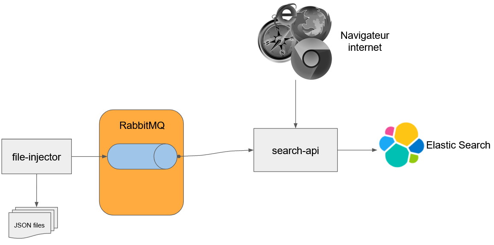

:hardbreaks-option:
ifdef::env-github[]
:tip-caption: :bulb:
:note-caption: :information_source:
endif::[]

= Broker et Moteur d’indexation

Préfixé par &#x1F4D8;, des "checkpoints" pour vous aider à vérifier que vous avez tout bon.

Ce projet a pour but de voir l’utilisation d’un broker de message (RabbitMQ) et d’un moteur d’indexation (ElasticSearch)

Nous allons utiliser :

* *Spring amqp* pour gérer l’intégration avec RabbitMQ
* *Spring web-mvc* pour gérer l’exposition de l’API de recherche

Le thème de ce projet est de construire un service d’autocomplétion pour un moteur de recherche de jeux vidéos.

== Architecture simplifiée

Le module *file-injector* sera un petit programme qui prendra en paramètre un fichier JSON contenant plusieurs documents et enverra chacun d’entre eux sur une file dans *RabbitMQ*.

Le module *search-api* sera un serveur HTTP qui :

* Fournira une API HTTP/JSON permettant la recherche de jeux-vidéos avec la syntaxe https://lucene.apache.org/core/2_9_4/queryparsersyntax.html[Lucene]
* Indexera dans *Elastic Search* tous les documents reçus sur la file dans *RabbitMQ*.

Une page HTML minimaliste permettant d’afficher les résultats de la recherche est fournie.

== Notation

La notation se découpera en plusieurs parties :

* Le projet compile
* Les projets démarrent (la méthode `fr.lernejo.search.api.Launcher#main` doit démarrer un serveur HTTP sur le port 8080)
* L’API `GET /api/games` décrite ci-dessous est
** Disponible
** Conforme aux schémas donnés
** Fonctionnelle (un appel à `GET /api/games?query=developer:Cybertopia` retourne les jeux développés par le studio *Cybertopia*)
* L’injecteur envoie les messages au format attendu dans la bonne file dans RabbitMQ 
* L’historique *GIT* lisible et propre
** Pas de message de commit sans _**intention**_
** Pas de commit successifs avec le même message
** (-0.5 point de pénalité par commit ne respectant pas ces règles)
** Voir cet article pour plus d’information https://chris.beams.io/posts/git-commit/
* Le **Style** doit permettre de lire le code facilement
** Les méthodes doivent faire moins de 15 lignes
** Les classes moins de 50 lignes
** Pas de champs mutables (tous les champs doivent être marqués final)
** Pas de champ ou méthode statique (sauf pour la méthode `main`)
** (-1 point de pénalité pour les écarts)
* L’intégration continue est fonctionnelle
* Les Badges de build et de couverture sont disponibles dans le fichier *README.md*
* La couverture du code est > *90%*

== Partie 0 - Création du dépôt via un template

* Sur la page du template https://github.com/lernejo/video_game_search_engine_template, cliquer sur "Use this template"
* Renseigner comme nom de dépôt : *video_game_search_engine*
* Marquer le futur dépôt comme *public*
* Créer le dépôt en cliquant sur "Create repository from template"
* N'oubliez pas de mettre à jour les badges, une fois vôtre repo créé (suivre -> https://github.com/lernejo/exercises/blob/c61f23726f8b4727a046924d5236d6769d25f1b0/maven_fr/EXERCISE.adoc#partie-6---live-badges[Partie 6])

== Partie 1 - Démarrer les outils tiers avec Docker Compose

Tout au long de ce projet, les deux applications auront besoins de RabbitMQ et ElasticSearch.

Grâce à Docker Compose (V2), il est possible de stocker la configuration nécessaire et de démarrer ces deux outils en une ligne de commande.

** Créer un fichier *docker-compose.yml* et y copier le contenu suivant :

[source,yml]
----
version: "3.9"
services:
    rabbitmq:
        # https://hub.docker.com/_/rabbitmq
        image: rabbitmq:3.9.13-management-alpine
        container_name: rabbitmq
        ports:
            - 5672:5672 # AMQP
            - 15672:15672 # HTTP (Management)
    elasticsearch:
        # https://hub.docker.com/_/elasticsearch
        image: elasticsearch:7.16.3
        container_name: elasticsearch
        ports:
            - 9200:9200
        environment:
            - discovery.type=single-node
            - xpack.security.enabled=true
            - ELASTIC_PASSWORD=admin
            - bootstrap.memory_lock=true
            - "ES_JAVA_OPTS=-Xms256m -Xmx512m"
----

* Démarrer les services avec la commande `docker compose up`
* &#x1F4D8; Vérifier que RabbitMQ est bien disponible (http://localhost:15672 guest/guest)
* &#x1F4D8; Vérifier qu’ElasticSearch est bien disponible (http://localhost:9200 elastic/admin)

== Partie 2 - AMQP => ElasticSearch

Le but de cette partie est de coder dans le module *search-api* un _listener_ AMQP qui indexera chaque message reçu dans ElasticSearch.

[NOTE]
====

Dans ElasticSearch, la notion d'index est similaire à la notion de table dans une base de données.

Il s'agit d'une catégorie dans laquelle on placera des documents ayant le même format.

Il sera par la suite possible de requêter cet index pour récupérer les documents qui correspondent aux critères de la requête.
====

* Ajouter la dépendance au client ElasticSearch (`org.elasticsearch.client:elasticsearch-rest-high-level-client`) dans la section `dependencyManagement` du POM racine, ainsi que dans la section `dependencies` du POM du module *search-api*
** La version de cette dépendance ne doit pas apparaître dans le POM enfant et doit être factorisée dans les propriétés du POM racine
** Pour trouver les versions disponibles d’un binaire Maven, direction https://mvnrepository.com/

* Créer une classe `ElasticSearchConfiguration` marquée comme étant une configuration au sens de Spring
* Y déclarer un bean de type `RestHighLevelClient` avec adresse, port, _username_ et _password_ configurables et avec comme valeurs par défaut `localhost`, `9200`, `elastic` et `admin`
** Les clés pour configurer ces valeurs doivent être `elasticsearch.host`, `elasticsearch.port`, `elasticsearch.username`, `elasticsearch.password`
** A noter que la classe `RestHighLevelClient` est dépréciée, mais fonctionne encore

[NOTE]
====
Il est possible de demander à Spring d’injecter des valeurs venant de la configuration.

Pour cela, on utilise l’annotation `@Value` avec comme paramètre le nom de la propriété à injecter entre `${` et `}`.

Spring se charge de transformer la valeur dans le type nécessaire (`String`, `int`, etc.)

[source,java]
----
void myMethod(@Value("${myProperty:0}") int myProperty) { // <1>
    
}
----

<1> La valeur 0 sera utilisée dans le cas où les sources de données de configuration (propriétés systèmes, fichiers application.yml, etc.) ne contiennent pas cette clé.
Il s’agit de la valeur par défaut.

====

* Créer une classe `AmqpConfiguration` à l’instar de la classe précédente
** Y déclarer la méthode suivante

[source,java]
----

static final String GAME_INFO_QUEUE = "game_info";

@Bean
Queue queue() {
    return new Queue(GAME_INFO_QUEUE, true);
}

----

* Créer une classe `GameInfoListener` marquée comme un _composant_ au sens de Spring
* Cette classe devra avoir une méthode `onMessage`
** Cette méthode sera annotée avec `@RabbitListener`, *annotation* qui prendre en paramètre le nom de la queue déclaré comme constante dans la classe précédente
** Cette méthode devra indexer le document ainsi reçu grâce à une instance de `RestHighLevelClient` injectée dans le constructeur de la classe
** L’indexation se fera dans l’index *games* avec l’id obtenu grâce au header AMQP `game_id`
** &#x1F4D8; Cette méthode est très simple et ne fait que la *_rupture protocolaire_* entre le protocole AMQP 0.9 et l’API d’ElasticSearch, par conséquent une dizaine de lignes incluant la gestion des erreurs est un grand maximum

* &#x1F4D8; Vérifier le bon fonctionnement du _listener_ en envoyant un message sur la file *game_info* via l’interface de http://localhost:15672[management de RabbitMQ]
Ce message doit avoir un header `id` avec une valeur cohérente et une propriété `content_type` avec une valeur représentant le contenu du message (cf types MIME)

== Partie 3 - Fichier => AMQP

Dans cette partie, nous allons construire un programme simple qui prendra en entrée un fichier JSON contenant un tableau de messages à envoyer et enverra chaque message sur la file *game_info* déjà crée dans RabbitMQ.

* Modifier la classe `fr.lernejo.fileinjector.Launcher` pour ouvrir le fichier passé comme premier paramètre du programme
* Ce fichier devra être lu par la librairie *jackson-databind* afin de pouvoir récupérer une _collection_ de messages
* Chacun de ces messages sera ensuite envoyé sur la file *game_info* en n’oubliant pas le `ContentType` et le header id (venant du contenu du message)
* Chaque message envoyé respectera le schema suivant :

[source,json]
----
{
    "$schema": "http://json-schema.org/schema#",
    "type": "object",
    "properties": {
        "title": {
            "type": "string"
        },
        "thumbnail": {
            "type": "string"
        },
        "short_description": {
            "type": "string"
        },
        "genre": {
            "type": "string"
        },
        "platform": {
            "type": "string"
        },
        "publisher": {
            "type": "string"
        },
        "developer": {
            "type": "string"
        },
        "release_date": {
            "type": "string"
        }
    },
    "required": [
        "title",
        "thumbnail",
        "short_description",
        "genre",
        "platform",
        "publisher",
        "developer",
        "release_date"
    ]
}
----

[NOTE]
====

Si les types du package `java.time` (comme `java.time.LocalDate` par exemple) sont utilisés dans les objets sérialisés, la dépendance supplémentaire *jackson-datatype-jsr310* est nécessaire.

Cette dépendance contient un module pour Jackson ; pour qu’il soit utilisé, il faut soit l’enregistrer nominativement, soit demander à l’instance d’`ObjectMapper` de découvrir et d’enregistrer tous les modules présents dans le _classpath_.

Enfin, pour que l’instance de `RabbitTemplate` puisse sérialiser les objets (différents de `String`), il faut lui enregistrer une instance de `Jackson2JsonMessageConverter`.
====

* &#x1F4D8; Vérifier le bon fonctionnement de l’_injecteur_, en lui faisant envoyer au _listener_ les messages contenus dans le fichier `games.json` qui est fourni dans les ressources de test
* Le programme doit se terminer une fois tous les messages envoyés
* &#x1F4D8; À nouveau ce code est relativement simple, la logique de l’injecteur ne devrait pas dépasser les 20 lignes de code

== Partie 4 - Requêtage avec le langage Lucene

Dans cette dernière partie, nous allons construire dans le module *search-api* l’API qui permettra de requêter ElasticSearch avec une requête écrite au format https://www.elastic.co/guide/en/kibana/current/lucene-query.html[Lucene].

* Créer le `@RestController` Spring qui transformera un appel `GET /api/games?query={query}` en requête sur ElasticSearch en renverra le résultat sous la forme d’un tableau JSON
** La `SearchRequest` qui doit être faite à ElasticSearch doit avoir une source de type `org.elasticsearch.index.query.QueryStringQueryBuilder`
** Il est possible de modifier le nombre de "hits" retournés avec le paramètre `size` du paramètre `source` de la requête
** Le plus simple pour sérialiser vers le _frontend_ est d’utiliser la version `java.util.Map` des "hits" et de les retourner dans une liste. Spring et Jackson s’occuperont du reste
** La structure du corps de la réponse sera donc une liste d’objets tels que décrit dans le schema de la partie 3

* &#x1F4D8; Vérifier le bon fonctionnement en utilisant l’interface web fournie (http://localhost:8080) et le jeu de données fourni
** La requête `developer:"Epic Games"` doit retourner 2 jeux
** La requête `genre:Strategy AND developer:"Epic Games"` ne doit en retourner qu’un

== The End

Vous pouvez aller plus loin si vous le souhaitez, mais vous ne serez noté que sur les points énoncés plus haut.
Les APIs, si vous les changez, doivent rester compatibles avec les schémas de l’exercice.
C’est-à-dire que :

* Des champs peuvent être ajoutés dans les réponses
* Des champs optionnels peuvent être ajoutés dans les requêtes
* Les champs existants ne peuvent pas être supprimés ou renommés
