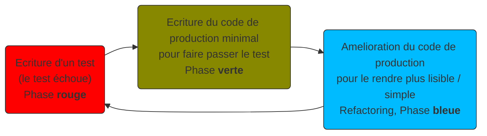

# Creation de graph UML

Préfixé par &#x1F4D8;, des "checkpoints" pour vous aider à vérifier que vous avez tout bon.

Ce projet a pour but de :

* Manipuler les APIs de reflections de Java (`java.lang.reflect`)
* Gagner en connaissance sur les diagrammes de classes UML
* Designer l'API publique d'une _library_ (bibliothèque)

Nous allons utiliser :

* le format [_Mermaid_](https://mermaid-js.github.io/mermaid/#/classDiagram)
* la bibliothèque **picocli** pour simplifier le _parsing_ et la validation des arguments de notre programme
* la bibliothèque **reflections** pour récupérer des types répondant à des critères spécifiques

Le thème de ce projet est de construire un outil générant le diagramme de classe (au format _Mermaid_) d'un code Java
non connu à l'avance.

A tout moment, vous pouvez tester le rendu des graphes avec l'outil : https://mermaid.live

## Notation

La notation se découpera en plusieurs parties :

* Le projet compile
* L'API Java (méthodes publiques de la classe `UmlGraph`) se comporte comme décrit dans le sujet
* Le programme (méthode `Launcher#main`) se comporte comme décrit dans le sujet
* L’historique *GIT* lisible et propre
    * Pas de message de commit sans _**intention**_
    * Pas de commit successifs avec le même message
    * (-0.5 point de pénalité par commit ne respectant pas ces règles)
    * Voir cet article pour plus d’information https://chris.beams.io/posts/git-commit/
* Le **Style** doit permettre de lire le code facilement
    * Les méthodes doivent faire moins de 18 lignes
    * Les classes moins de 50 lignes
    * Pas de champs mutables (tous les champs doivent être marqués `final`)
    * Pas de champ ou méthode statique (sauf pour la méthode `main`, ou les _factory methods_ dans les `enum`
      et `record`)
    * (-1 point de pénalité pour les écarts)
    * :warning: le code ne doit pas être compacté / minifié (plusieurs expressions ou blocs sur une même ligne)
        * (-4 points de pénalité dans ce cas)
* L’intégration continue est fonctionnelle
* Les Badges de build et de couverture sont disponibles dans le fichier **README.md**
* La couverture du code est > *85%*

## Partie 0 - Création du dépôt via un template

* Sur la page du template https://github.com/lernejo/maven_starter_template, cliquer sur "Use this template"
* Renseigner comme nom de dépôt : **uml_grapher**
* Marquer le futur dépôt comme **privé**
* Inviter le professeur actuel comme membre du dépôt (pour la correction)
* Créer le dépôt en cliquant sur "*Create repository from template"*
* N'oubliez pas de mettre à jour les badges, une fois votre repo créé (suivre
  -> https://github.com/lernejo/exercises/blob/master/maven_fr/EXERCISE.adoc#partie-6---live-badges)

## Partie 1 - Créer un premier test, puis le code correspondant

Dans cette première partie, nous allons coder un test avant de coder le code testé.  
C'est l'une des techniques utilisées dans le cadre du TDD (**T**est **D**riven **D**evelopment).

<details>
  <summary>En savoir plus</summary>

---

## :bulb:

Le TDD est une technique de _design_ (et non de test) qui consiste (entre autre) à écrire les tests avant le code testé.

Le but de cette technique est de converger au fur et à mesure des itérations vers la forme la plus simple (utilisable,
car utilisé par les tests) et nécessaire (aucun code mort ou non testé).

La pratique du TDD consiste en 3 lois que voici :

* On n'écrit pas de code de production tant qu’on n’a pas écrit un test unitaire qui échoue (ne pas compiler == échec)
* On n'écrit pas plus d'un seul test unitaire qui échoue
* On n'écrit pas plus de code de production que nécessaire pour que le test unitaire réussisse

Ainsi le cycle de développement itératif est celui-ci :



---
</details>

* Créer un premier test dans le package `fr.lernejo` tel que :

```java
class UmlGraphTests {
    @Test
    void empty_interface_with_no_relation() {
        UmlGraph graph = new UmlGraph(Machin.class);

        String output = graph.as(GraphType.Mermaid);

        Assertions.assertThat(output).isEqualTo("""
            classDiagram
            class Machin {
                <<interface>>
            }
            """);
    }

    interface Machin {
    }
}
```

* &#x1F4D8; A cette étape, le projet ne compile pas, car les classes utilisées n'existent pas toutes
* Faire passer ce test, en codant, dans le package `fr.lernejo.umlgrapher` la `class` `UmlGraph` et l'`enum` `GraphType`
* &#x1F4D8; A cette étape, le projet compile et la commande `mvn test` execute 1 unique test et se termine en succès

## Partie 2 - Utilisation du programme en ligne de commande

Actuellement le code de production du projet est utilisable en tant que bibliothèque (tout ce qui est public, notamment
classes et méthodes).

Dans cette partie, nous allons créer une fonction `main` afin que l'outil puisse également être utilisé tout seul (de
manière _standalone_).

* Ajouter la dépendance vers la bibliothèque **picocli** dans sa dernière version
* :information_source: Il est possible de chercher les coordonnées de binaires dans le dépôt Maven central
  via https://search.maven.org
* :information_source: les coordonnées qui nous intéressent pour ce projet sont celles de la dépendance officielle du
  projet **picocli**, vous trouverez plus d'info sur le dépôt GitHub ou dans la documentation officielle
* Créer la classe `fr.lernejo.umlgrapher.Launcher` qui contiendra une méthode `main` telle que décrite dans la
  documentation de **picocli**: https://picocli.info/#_example_application
* Modifier `Launcher` de telle sorte que le programme ait deux options :
    * `-c` ou `--classes` qui permettra de renseigner **les** classes d'où faire partir l'analyse. Cette option doit
      être _obligatoire_
    * `-g` ou `--graph-type` qui permettra de sélectionner le type de graph que l'on souhaite en sortie (
      seulement `GraphType.Mermaid` pour le moment). Cette option aura pour valeur par défaut `GraphType.Mermaid`
* Il sera nécessaire de modifier le constructeur de `UmlGraph` pour prendre un paramètre _variadique_ et ainsi pouvoir
  réaliser l'analyse depuis plusieurs classes
* &#x1F4D8; Vérifier que si vous lancer le programme avec les arguments `-c fr.lernejo.UmlGraphTests$Machin` le résultat
  est bien le même qu'avec le test unitaire (il sera nécessaire de rajouter au classpath le chemin `target/test-classes`
  pour que la classe `Machin` soit accessible au code de production)

## Partie 3 - Parcourir les types parents

À partir de cette partie, aucune indication précise sur le design des objets n'est donnée.

De même pour les tests, c'est à vous de créer les tests qui vous semblent pertinents pour les fonctionnalités que vous
ajouterez.

Afin de vous simplifier la vie pour les tests, il est recommandé d'avoir une sortie au format Mermaid _déterministe_;
c'est-à-dire que les différentes lignes composant la sortie doivent toujours avoir le même ordre.  
Dans cette optique, vous pouvez utiliser des structures de données qui respectent l'ordre et sont triables, telles
que `java.util.List`, ou encore `java.util.TreeSet` qui ordonne les éléments ajoutés en fonction d'une fonction de
comparaison donnée en paramètre.

Example pour une structure de données contenant des objets de type `UmlType` qui triera ses éléments
par `UmlType#name()`, puis par `UmlType#packageName()` :

```java
private final Set<UmlType> types = new TreeSet<>(Comparator
    .<UmlType, String>comparing(t->t.name())
    .thenComparing(t->t.packageName()));

    ...
    types.add(type1);
    types.add(type2);
// etc.
```

Afin de respecter les critères de notation, il est conseillé de séparer le code en objets avec des responsabilités bien
distinctes (tels que `InternalGraphRepresentation`, `MermaidFormatter`, `UmlRelation` ou encore `UmlType`, mais encore une fois, vous découpez votre code comme vous l'entendez).

Seule l'API publique existante ne doit pas changer, car elle sera appelée de manière programmatique par la correction
auto.

Dans cette partie, ajouter la notion de relation aux types parents.

* Une classe peut avoir
    * une classe parente (la classe `java.lang.Object` devra être ignorée)
    * zero, une ou plusieurs interfaces
* Une interface peut hériter de zero, une ou plusieurs autres interfaces

* Pour récupérer la classe parente, on peut utiliser la méthode `myClass.getSuperclass()`
* Pour récupérer les interfaces implémentées/héritées, on peut utiliser la méthode `myClass.getInterfaces()`
* Pour savoir si un type est une interface : `Modifier.isInterface(myClass.getModifiers())`
* etc.

* Il est recommandé de parcourir la hiérarchie de type de manière récursive

* Dans le format _Mermaid_,

    * La relation d'héritage (classe/classe, interface/interface) est écrite :

```bash
InterfaceParente <|-- InterfaceEnfant : extends
```

* la relation d'implémentation (interface/classe) est écrite :

```bash
InterfaceParente <|.. ClasseEnfant : implements
```

* &#x1F4D8; A cette étape, créer le graphe pour `Ant`, `Cat` et `Alder` donnera le graphe
  suivant :

```
classDiagram
class Alder
class Animal {
    <<interface>>
}
class Ant
class Cat
class Living {
    <<interface>>
}
class Plant {
    <<interface>>
}
class Tree {
    <<interface>>
}
Tree <|.. Alder : implements
Living <|-- Animal : extends
Animal <|.. Ant : implements
Animal <|.. Cat : implements
Living <|-- Plant : extends
Plant <|-- Tree : extends
```

Compte tenu des types suivants :

```java
public sealed interface Living {
    sealed interface Animal extends Living {
        final class Ant implements Animal {
        }

        final class Cat implements Animal {
        }
    }

    sealed interface Plant extends Living {
        sealed interface Tree extends Plant {
            final class Alder implements Tree {
            }
        }
    }
}
```

## Partie 4 - Parcourir les types enfants

Dans cette partie, nous allons implémenter le parcours des types enfants (en plus de celui des types parents).

Il sera donc nécessaire de mettre en place une condition dans le code afin d'éviter de boucler infiniment entre enfant
et parent.

Il n'est pas aisé de trouver les types enfants en Java, car il faut parcourir l'ensemble des classes disponibles dans
le _classpath_ et vérifier pour chacune si elles sont le sous-type d'une autre.

Nous allons donc nous servir d'une bibliothèque tierce qui fera ce travail pour nous.

* Ajouter la dépendance à la bibliothèque **reflections** (chercher les coordonnées exactes dans la doc)
* Voici le code pour créer une instance de l'objet `Reflections` qui scanne toutes les classes, indépendamment du _package_ :

```java

Class<?> type = ...;

Reflections reflections = new Reflections(new ConfigurationBuilder()
    .forPackage("")
    .forPackage("", type.getClassLoader())
);
```
* :warning: La ligne `.forPackage("", type.getClassLoader())` est importante afin de scanner des classes qui seraient issues d'un autre classloader que celui qui a chargé votre code (et qui devrait être le `AppClassLoader`)

* Ainsi, pour un type donné, on peut requêter l'index créé par l'objet de type `Reflections` et obtenir les sous-types _
  directs_ :

```java
Class<?> type = Animal.class; // example
Set<Class<?>> subTypes = reflections.get(
    Scanners.SubTypes
        .get(type)
        .asClass(this.getClass().getClassLoader(), type.getClassLoader())
    ); // will contain [Ant.class, Cat.class]
```

* &#x1F4D8; A cette étape, créer le graphe pour le tableau de paramètre `Living` devra créer le même graphe que celui
  proposé dans la partie précédente

## Partie 5 - Ajouter les méthodes et les champs

* Ajouter l'information des méthodes et champs existants sur les types
* Pour lister les méthodes d'un type : `myType.getDeclaredMethods()`
* Pour lister les champs d'un type : `myType.getDeclaredFields()`
* Pour connaitre la visibilité d'une méthode : `Modifiers.isPrivate(myMethod.getModifiers()`
* Explorer les méthodes disponibles sur les objets de type `Method` et `Field` afin d'extraire les informations nécessaires :
  * type de retour
  * types et noms des paramètres
  * visibilités (private, public, etc.)
  * caractéristiques (statique, abstract)
* Il sera nécessaire d'exclure les méthodes et champs _synthétiques_ (cf. [la specification du langage](https://docs.oracle.com/javase/specs/jls/se17/html/jls-13.html))
* De même pour les `enum` il faudra exclure les méthodes `valueOf` et `values`
* Tenez compte de ces informations pour générer le graphe au format Mermaid (cf. la [documentation](https://mermaid-js.github.io/mermaid/#/classDiagram?id=defining-members-of-a-class))
* Pour alléger la lisibilité, ajouter les règles suivantes :
  * Les types dont le package commencent par `java.` ne seront pas représentés dans le graphe (mais ils peuvent être utilisé dans les champs et méthodes, cf `int` et `String` dans le graphe ci-dessous)
  * S'il y a deux relations ("returns" et "uses") entre deux objets, seules la relation "returns" sera gardée
* &#x1F4D8; A cette étape, créer le graphe pour `Singleton` donnera le graphe suivant :

```
classDiagram
class Singleton {
    -Singleton instance$
    +getInstance()$ Singleton
    +supplySomeStr(int offset) String
}
Singleton <-- Singleton : returns
```

Compte tenu des types suivants :

```java
public class Singleton {

    private static final Singleton instance = new Singleton();

    public static Singleton getInstance() {
        return instance;
    }

    public String supplySomeStr(int offset) {
        return String.valueOf(43 + offset);
    }
}
```

* &#x1F4D8; De la même façon, créer le graphe pour `Image` donnera le graphe suivant :

```
classDiagram
class Image {
    <<interface>>
    +display() void
}
class LazyLoadedImage {
    -String fileName
    -RealImage realImage
    +display() void
}
class RealImage {
    -String fileName
    +display() void
    -loadFromDisk(String fileName) void
}
Image <|.. LazyLoadedImage : implements
RealImage <-- LazyLoadedImage : uses
Image <|.. RealImage : implements
```

Compte tenu des types suivants :

```java
public sealed interface Image {

    void display();

    final class RealImage implements Image {

        private final String fileName;

        public RealImage(String fileName){
            this.fileName = fileName;
            loadFromDisk(fileName);
        }

        @Override
        public void display() {
            System.out.println("Displaying " + fileName);
        }

        private void loadFromDisk(String fileName){
            System.out.println("Loading " + fileName);
        }
    }

    final class LazyLoadedImage implements Image{

        private RealImage realImage;
        private final String fileName;

        public LazyLoadedImage(String fileName){
            this.fileName = fileName;
        }

        @Override
        public void display() {
            if(realImage == null){
                realImage = new RealImage(fileName);
            }
            realImage.display();
        }
    }
}
```
