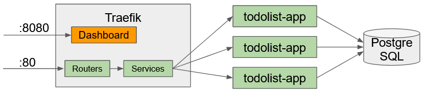

= Application web simple avec Spring

ifdef::env-github[]
:tip-caption: :bulb:
:note-caption: :information_source:
endif::[]

:hardbreaks-option:

Préfixé par &#x1F4D8;, des "checkpoints" pour vous aider à vérifier que vous avez tout bon.

L’objectif de cet exercice est de construire une application web minimaliste (TODO list), utilisant *spring-mvc* pour la partie HTTP et *spring-data-jdbc* pour la partie persistance des données.

== Prérequis

* Installer Git (cf https://git-scm.com/book/en/v2/Getting-Started-Installing-Git)
* (Sur Windows, avoir un terminal POSIX type **Git Bash**, la suite de l’exercice est à faire dans celui-ci)
* Configurer Git avec votre nom et email
** `git config --global user.name "John Doe"`
** `git config --global user.email johndoe@example.fr`
* Générer une clé SSH (si absente) et donner la partie publique à GitHub (cf https://help.github.com/articles/connecting-to-github-with-ssh/)

* Installer Java 17 (cf https://adoptium.net/)
* &#x1F4D8; Les commandes `javac -version` et `java -version` doivent afficher la version **17**

* Installer Maven (cf https://maven.apache.org/install.html)
* &#x1F4D8; la commande `mvn -version` doit afficher la version *3.8.6*

* Installer IntelliJ Community (cf https://www.jetbrains.com/fr-fr/idea/download)

* Installer Docker Compose V2 (Docker Desktop pour Windows et Mac)

== Partie 1 - Création du dépôt via un template

* Sur la page du template https://github.com/lernejo/maven_starter_template, cliquer sur "Use this template"
* Renseigner comme nom de dépôt : **web_app_spring_training**
* Marquer le futur dépôt comme **public**
* Créer le dépôt en cliquant sur "*Create repository from template*"
* N'oubliez pas de mettre à jour les badges, une fois votre repo créé (suivre
  -> https://github.com/lernejo/exercises/blob/master/maven_fr/EXERCISE.adoc#partie-6---live-badges)
* Cloner ce nouveau dépôt en utilisant l'*url SSH*
* La branche par défaut est la branche *main* c'est sur celle-ci que nous allons travailler

== Partie 2 - BOM & Dépendances

[NOTE]
====
On appelle BOM (**B**ill **O**f **M**aterials), une liste de librairies et frameworks dont les versions sont garanties compatibles.

En effet, l’écosystème Java évolue très vite, et des changements incompatibles (méthodes ou classes qui disparaissent, etc.) arrivent fréquemment.

Ainsi les plus gros frameworks (comme Spring-Boot) publient des BOM pour assurer que tous les binaires en dépendance d’un projet fonctionnent bien les uns avec les autres
====

* Dans le fichier *pom.xml*, ajouter le BOM de Spring-Boot dans la section `<dependencyManagement>`

[source,xml]
----
<dependencyManagement>
    <dependencies>
        <dependency>
            <groupId>org.springframework.boot</groupId>
            <artifactId>spring-boot-dependencies</artifactId>
            <version>2.7.4</version>
            <scope>import</scope>
            <type>pom</type>
        </dependency>
    </dependencies>
</dependencyManagement>
----

* Ajouter la dépendance qui nous intéresse dans la section `<dependencies>`

[source,xml]
----
<dependencies>
    <dependency>
        <groupId>org.springframework.boot</groupId>
        <artifactId>spring-boot-starter-web</artifactId>
        <!--1-->
    </dependency>
</dependencies>
----

<1> La version n’est pas précisée car elle est gérée par le BOM

== Partie 3 - Endpoints HTTP

Nous allons coder deux endpoints HTTP qui permettrons de

* Consulter une liste de note
* Ajouter une note

L’état dans un premier temps sera géré en mémoire grâce à une `java.util.ArrayList`.

Spring-mvc fourni un certain nombre d’annotations pour indiquer au framework le rôle des classes ou des méthodes.
Dans notre cas, ce qui nous intéresse c’est :

* `@RestController` : marque une classe comme étant un contrôleur (adaptateur HTTP)
* `@GetMapping` : marque une méthode comme gérant une requête HTTP *GET*
* `@PostMapping` : marque une méthode comme gérant une requête HTTP *POST*
* `@RequestBody` : marque un paramètre de méthode indiquant au framework d’y injecter le corps d’une requête HTTP, en le désérialisant (transformation du texte JSON en objet Java)

* Créer un record `fr.lernejo.todo.Todo` avec deux paramètres `message` et `author`
* Créer une classe `fr.lernejo.todo.TodoListController`
* Ajouter deux méthodes, une pour ajouter un `Todo` dans la liste, une autre qui renverra cette liste
* Annoter ces méthodes de façon à ce qu’elle réponde sur les requêtes HTTP suivantes :
** *POST* /api/todo
** *GET* /api/todo
* Créer une classe `fr.lernejo.todo.TodoListApp` annotée avec `@SpringBootApplication`
* Y ajouter une fonction `main` avec le contenu suivant : `SpringApplication.run(TodoListApp.class, args);`
* Lancer l’application grâce à la méthode `main`, par défaut le serveur lancé par le framework écoute sur le port 8080
* Vérifier que les endpoints HTTP fonctionnent comme attendu avec un client HTTP (navigateur, curl, etc.)
* Indexer et commiter les fichiers nouvellement créés

== Partie 4 - Filtre pour ajouter un header HTTP

Pour identifier les différentes instances si notre application est dimensionnée horizontalement, nous allons créer un filtre qui ajoutera un header *Instance-Id* à chaque réponse HTTP.

[NOTE]
====
Un filtre est un composant implémentant l’interface `javax.servlet.Filter`, qui sera sollicité à l’arrivée d’une nouvelle requête.

Implémentant le pattern *chaîne de responsabilité* le rôle d’un filtre (un maillon de la chaîne) est de faire une opération et de [.underline]#passer la main au filtre d’après# :

[source,java]
----
chain.doFilter(request, response);
----

Un filtre peut également décider d’interrompre la chaîne, auquel cas la réponse HTTP sera renvoyée telle quelle.
====

* Créer une classe `fr.lernejo.todo.ApplicationIdentifierFilter` implémentant l’interface `javax.servlet.Filter` et annotée avec `@Component`
* Générer un `UUID` aléatoire dans le constructeur de cette classe, et stocker sa conversion en `String` dans un champ de la classe
* Dans l’implémentation de la méthode `doFilter` ajouter le header *Instance-Id* avec cette valeur à la réponse avant d’appeler le maillon suivant de la chaîne de responsabilité.
Pour cela, la réponse doit être _matchée_ vers le type `javax.servlet.http.HttpServletResponse` qui lui possède une méthode `setHeader`

[NOTE]
====
Le pattern-matching est un outil qui permet de distinguer des branches d'exécutions en fonction d'un type, ou même de son contenu.

En Java, le pattern matching est en construction.

Mais on peut déjà l'utiliser pour créer une variable du bon type sans _downcast_.

[source,java]
----
public void myMethod(Object myParam) {
    if (myParam instanceof String myString) {
        // <1>
    }
}
----
<1> Ici la variable `myString` de type String est disponible. On ne rentrera pas dans le `if` si le paramètre donné n'est pas un `String`

* Démarrer l’application et vérifier la présence du header *Instance-Id* dans un appel au endpoint *GET*
* Plusieurs appels retournerons même header, cependant si l’application redémarre, celui-ci changera
* Indexer et commiter les fichiers nouvellement créés

== Partie 5 - Image Docker de notre application et Docker Compose

Docker est un outil permettant de lancer des conteneurs reposant sur des images.
Les images elles-mêmes sont des archives contenant les binaires nécessaires/voulus (os, tools, app, etc.)

Docker Compose est un ordonnanceur de conteneur, l’idée est de pouvoir piloter depuis un même fichier descripteur un ensemble de conteneur de manière cohérente.

* Ajouter dans la section `<build>` du fichier *pom.xml* le contenu suivant

[source,xml]
----
<build>
    <plugins>
        <plugin>
            <groupId>org.springframework.boot</groupId>
            <artifactId>spring-boot-maven-plugin</artifactId>
            <version>2.5.5</version>
            <executions>
                <execution>
                    <goals>
                        <goal>repackage</goal> <!--1-->
                    </goals>
                </execution>
            </executions>
        </plugin>
    </plugins>
</build>
----

<1> Le goal *repackage* de ce plugin fourni par Spring-Boot va remplacer le jar créé par le *maven-jar-plugin* par un jar auto-exécutable contenant également le code des dépendances

// -

* Créer un fichier *Dockerfile* à la racine du projet (à côté du fichier *pom.xml*)
* Y copier le contenu suivant

[source,Docker]
----
# <1>
FROM maven:3.8.3-openjdk-17 AS build
COPY src /home/app/src
COPY pom.xml /home/app
# <2>
RUN mvn -f /home/app/pom.xml clean package

# <3>
FROM eclipse-temurin:17-jdk-focal
# <4>
COPY --from=build /home/app/target/maven_training-1.0.0-SNAPSHOT.jar /usr/local/lib/app.jar
# <5>
EXPOSE 8080
ENTRYPOINT ["java","-jar","/usr/local/lib/app.jar"]
----

<1> Image contenant Maven utilisée pour construire le projet dans une étape "*build*"
<2> Lancement de la construction du projet
<3> Image de base utilisée pour l’image finale, Maven n’y est pas
<4> Il peut être nécessaire de changer le nom de l’archive construite si le nom ou la version du projet a été changée
<5> L’application écoute sur le port 8080, ce que nous indiquons comme paramètre de l’image finale pour pouvoir gérer les redirections de port et la configuration réseau par la suite

// -

* Créer un fichier *docker-compose.yml* à la racine du projet
* Y copier le contenu suivant

[source,yml]
----
version: "3.9"
services:
  todolist:
    build : . # <1>
    ports:
      - 8081:8080 # <2>
----

<1> Utilise le fichier *Dockerfile* dans le même répertoire
<2> Redirige le port 8081 de la machine hôte (gauche) vers le port 8080 du container (droite)

// -

* Démarrer l’application avec la commande `docker compose up`
* Vérifier que le service est bien disponible (GET http://localhost:8081/api/todo)
* Indexer et commiter les fichiers nouvellement créés

== Partie 6 - Dimensionnement et répartition de la charge

Nous allons maintenant mettre en place un load-balancer pour répartir le traffic HTTP sur plusieurs instances de notre application.

* Ajouter dans le fichier *docker-compose.yml* le contenu suivant sous *services*

[source,yml]
----
traefik:
    image: traefik:2.5
    restart: unless-stopped
    ports:
      - 80:80
      - 8080:8080
    volumes:
      - /var/run/docker.sock:/var/run/docker.sock:ro
      - ./traefik.toml:/traefik.toml
----

* Créer un fichier *traefik.toml* à la racine du projet avec le contenu suivant :

[source,toml]
----
[global]
  sendAnonymousUsage = false

[accessLog]

[log]
  level = "DEBUG"
  format = "common"

[providers]
  [providers.docker]
    endpoint = "unix:///var/run/docker.sock"
    watch = true
    exposedByDefault = true
    swarmMode = false

[api]
  dashboard = true
  debug = false
  insecure = true

[entryPoints]
  [entryPoints.insecure]
    address = ":80"
----

[NOTE]
====
Traefik possède un dashboard qui est consultable à l’url http://localhost:8080.
Le port *8080* est utilisé pour l’administration alors que le port *80* est utilisé pour le service.
Quand Traefik utilise le _provider_ Docker, la configuration du routage est déduite des labels renseignés sur chaque service Docker Compose.
====

* Ajouter les labels suivants au service *todolist* dans le fichier *docker-compose.yml* :

[source,yml]
----
labels:
- "traefik.http.routers.todolist.rule=PathPrefix(`/app`)"
- "traefik.http.middlewares.todolist.stripPrefix.prefixes=/app"
- "traefik.http.routers.todolist.middlewares=todolist@docker"
----

* Lancer les différents containers grâce à la commande `docker compose up`
* Vérifier que le service est rendu derrière l’url http://localhost:80/app/api/todo
* Supprimer le port de machine hôte spécifié dans la configuration du service *todolist* dans le fichier *docker-compose.yml*

[NOTE]
====
Un port ne peut pas être écouté par plus d’un process.
Si un port de la machine hôte est fixé dans la configuration d’un service Docker Compose, celui-ci ne peut pas être dimensionné avec la fonctionnalité replica
====

* Ajouter la configuration suivante à ce même service pour qu’il y en ait 3 instances

[source,yml]
----
deploy:
  replicas: 3
----

* Lancer les différents containers grâce à la commande `docker compose up`
* Vérifier que le header *Instance-Id* a 3 valeurs distinctes quelque-soit le nombre d’appels HTTP qui sont fait
* Indexer et commiter les changements

== Partie 7 - Persistence en base de données

Pour l’instant l’état de notre application est géré dans la mémoire de notre application, et par conséquence dans des mémoires différentes en fonction de l’instance sur laquelle un appel HTTP est redirigé.

Le comportement du point de vue de l’utilisateur est perçu comme incohérent.

En effet, ce genre d’application dite _stateful_ (car ayant un état) n’est pas compatible avec le dimensionnement horizontal.

On va dans ce cas s’orienter vers une application _stateless_ (car n’ayant pas d’état) et gérer l’état ailleurs.

Il existe pléthore de solutions pour partager de l’état entre des instances distinctes (brokers, cache, base de données, mémoire partagée type Hazelcast, etc.)

Dans cet exercice, nous allons stocker l’état dans une base PostgreSQL.

* Ajouter dans le fichier pom.xml les dépendances suivantes

[source,xml]
----
<dependency>
    <groupId>org.springframework.boot</groupId>
    <artifactId>spring-boot-starter-data-jdbc</artifactId>
</dependency>
<dependency>
    <groupId>org.postgresql</groupId>
    <artifactId>postgresql</artifactId>
    <version>42.5.0</version>
</dependency>
----

* Créer un fichier *application.yml* dans le répertoire *src/main/resources* avec le contenu :

[source,yml]
----
spring:
  sql.init.mode: always # <1>
  datasource:
    url: jdbc:postgresql://localhost:5432,postgres:5432/postgres
    username: postgres
    password: example
----
<1> Configuration qui permet d’exécuter le fichier *schema.sql* au démarrage de l’application

* Créer à côté un fichier *schema.sql* avec le contenu :

[source,sql]
----
CREATE TABLE IF NOT EXISTS todo (
    id BIGSERIAL PRIMARY KEY,
    message TEXT,
    author CHAR(64)
);
----

* Créer une classe `fr.lernejo.todo.TodoEntity` annotée avec `@Table("todo")`
* Ajouter 3 champs _publics_ _mutables_
** `Long id` annoté avec `@Id`
** `String message`
** `String author`

[NOTE]
====
Les outils de persistance actuels (Spring-data, Hibernate, etc.) fonctionne sur la base d’_entités_ qui représente au format objet les données en base.

Les entités (par extension, JPA) sont attendues comme étant des objets répondant à certains critères, notamment celui d’être _mutable_.
====

* Créer une interface `fr.lernejo.todo.TodoRepository` annotée avec `@Repository` et étendant `CrudRepository<TodoEntity, Long>`

[NOTE]
====
Ici la _magie_ de Spring va opérer, l’interface aura une implémentation au runtime (pas de classe concrète donc) par l’intermédiaire d’un proxy dynamique.

Ainsi toutes les méthodes de cette interface qui permettent des opérations standards comme sauvegarder, supprimer, lister, trouver par id, etc. auront un comportement (standard) sans qu’il soit besoin de le coder.

C’est l’implémentation la plus avancée du pattern *Generic DAO*.
====

* Modifier la classe `TodoListController` pour :
** Prendre comme paramètre de constructeur un objet de type `TodoRepository`
** Utiliser ce repository dans les méthodes en remplacement de l’`ArrayList`
** Supprimer le champ de type `ArrayList` devenu inutile

* Modifier le fichier `docker-compose.yml` en y ajoutant le service suivant

[source,yml]
----
postgres:
    image: postgres:14.0-alpine
    container_name: postgres
    ports:
      - 5432:5432
    environment:
      POSTGRES_PASSWORD: example
----

* Relancer la construction de l’image docker avec la commande `docker compose build`
* Lancer les différents containers avec la commande `docker compose up`
* Vérifier la cohérence de comportement dans l’API malgré l’utilisation d’instances différentes à travers l’url http://localhost:80/app/api/todo
* Indexer et commiter les changements

Un petit schema de l’architecture du projet que vous venez de réaliser pour finir :

